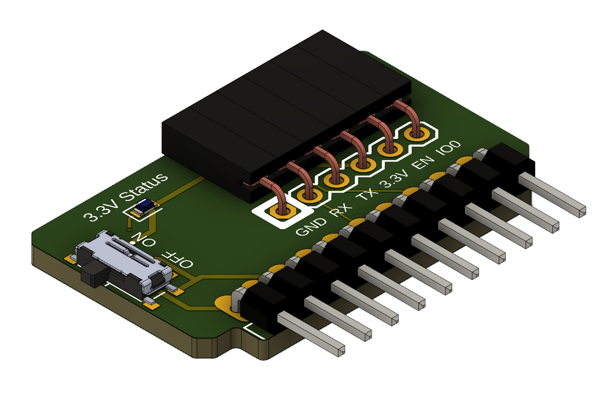

# flipperzero-flasher-board

Since version XXXX you can set RTS/DTR pins to pins 16/15 and use only one row of pins for this flasher board.

I made this simple board to flash my ESP32 projects. It uses the [ESPFlash](https://github.com/SuperHouse/ESPFlash) pinout. Flasher has a switch to toggle 3.3V from Flipper Zero if you need to power the device you are flashing from an external power source.